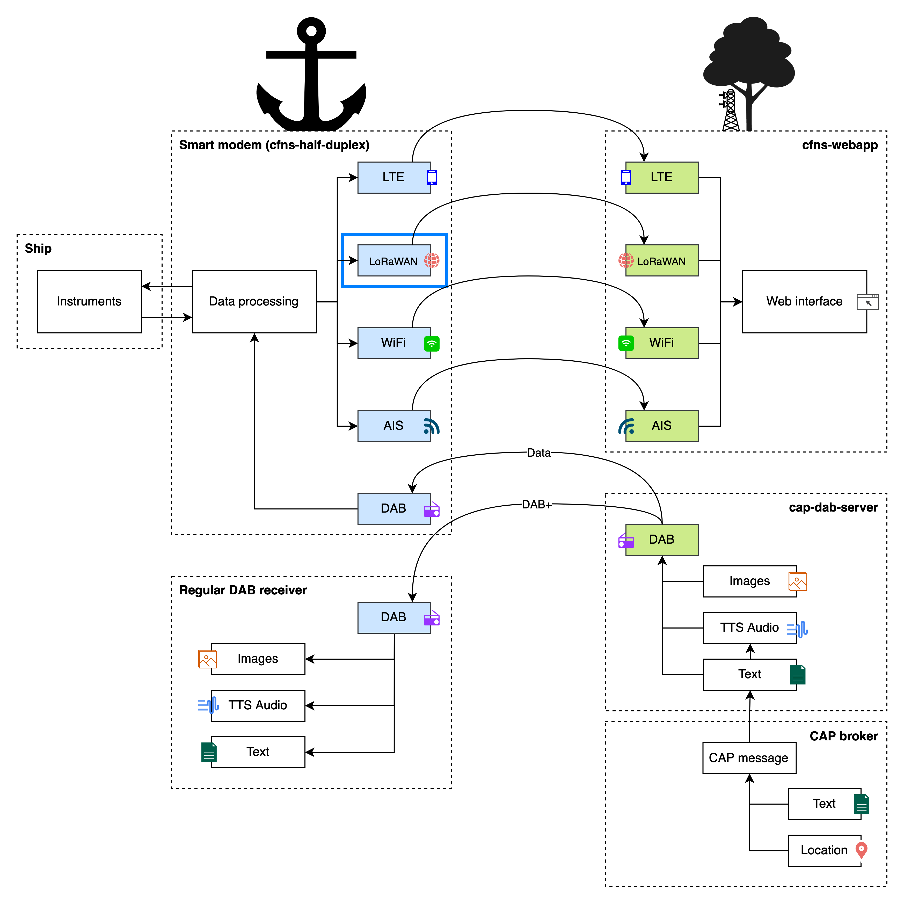

# cfns-hd-so
This code is developed for the Sodaq One in the project Half-Duplex

This application interfaces with
[cfns-half-duplex](https://github.com/PoCDAB/cfns-half-duplex). See the diagram
below.

# Credit
This repository has been forked from
[SodaqMoja/Sodaq_Ublox_GPS](https://github.com/SodaqMoja/Sodaq_UBlox_GPS).
